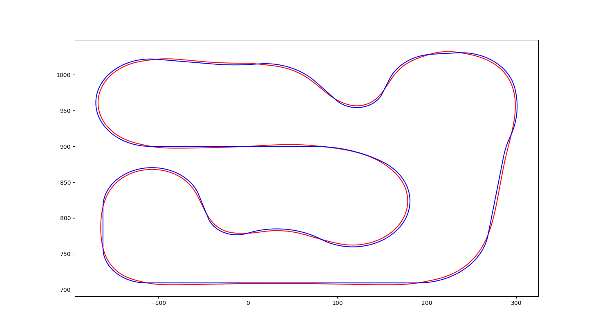

# SAIC_competition
2020 SAIC software challange 
which question: ***mission 1-3***
 
## Done:
1. reference line 生成:基于三次样条曲线转化为Frenet坐标系下的分段样条曲线；
2. 寻找最优路线：利用最小曲率与最短距离作为目标函数，利用osqp求解二次规划问题；

    
	  
 

   
 
### reference:
1. https://github.com/AtsushiSakai/PythonRobotics
